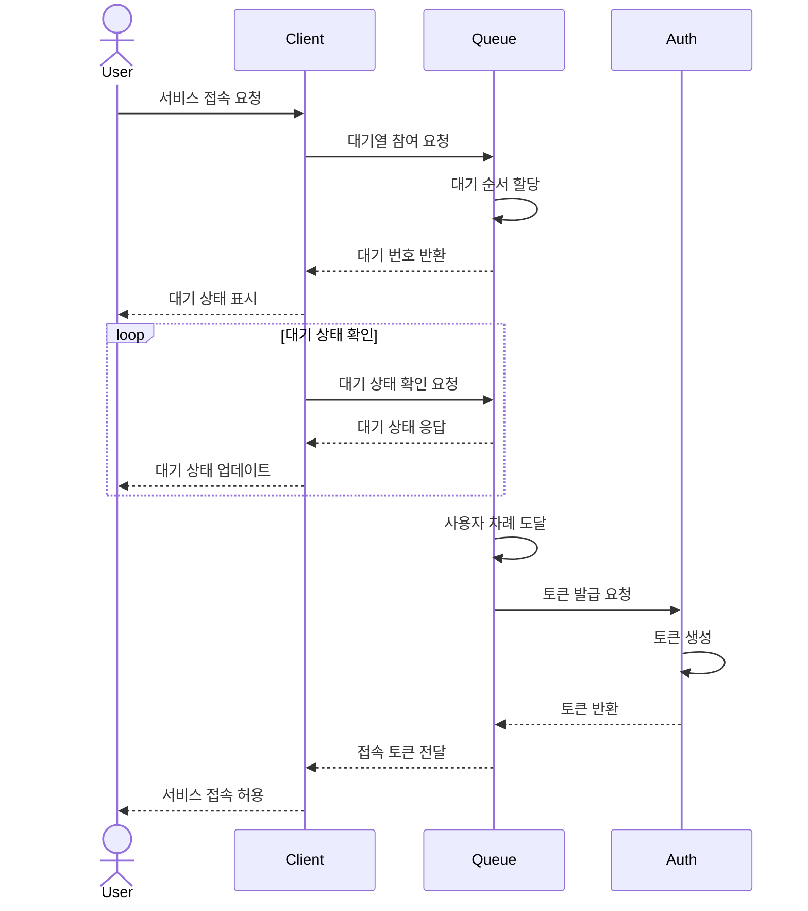
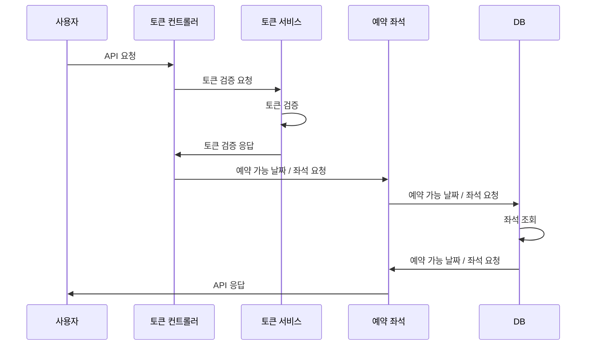
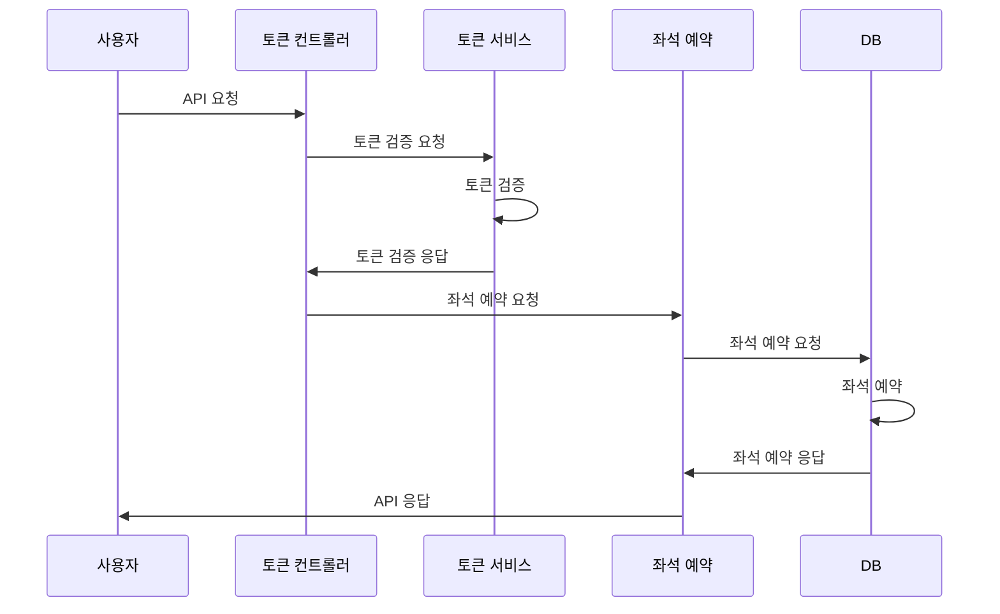
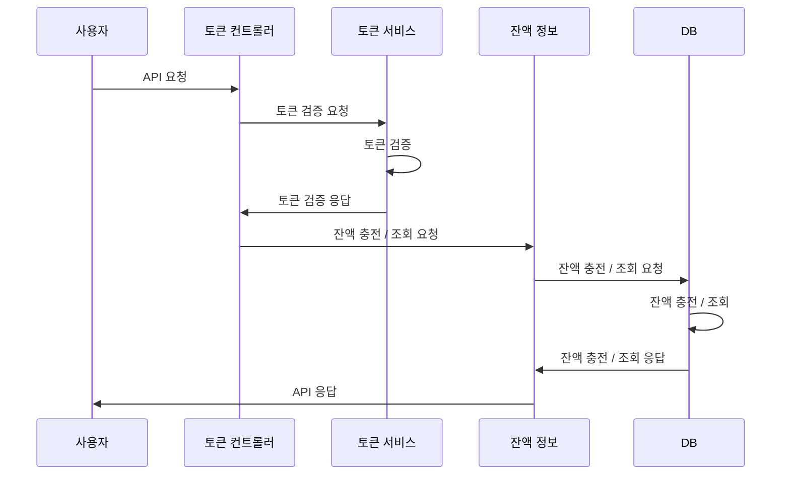
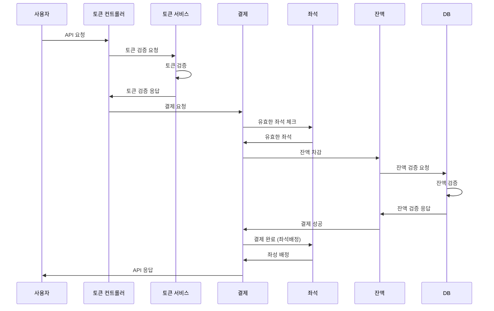
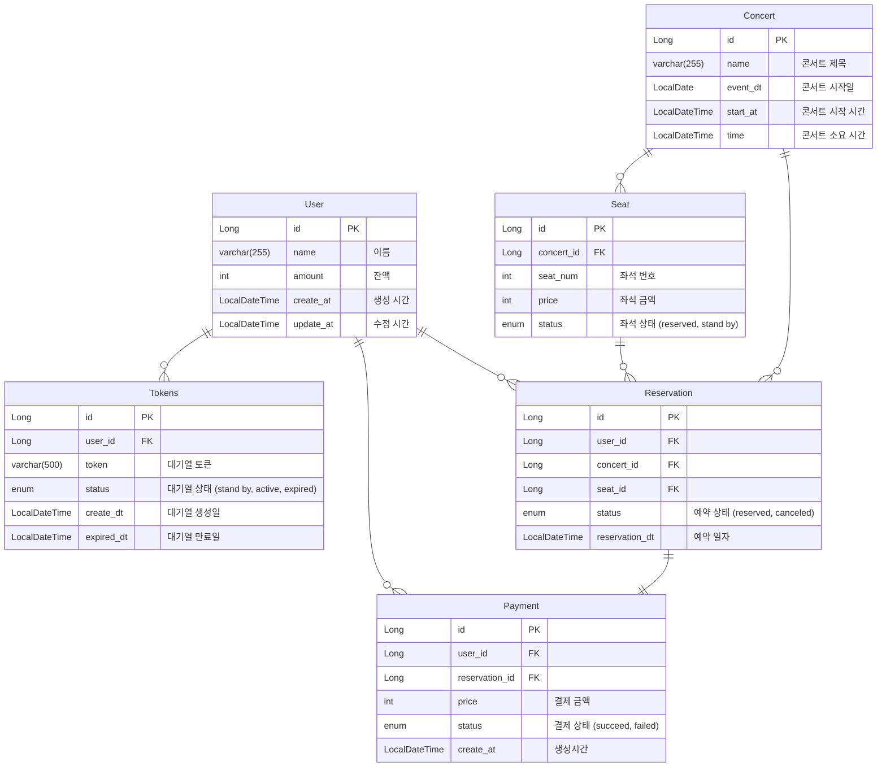

# hhplus-concert

# 콘서트 예약
- **`콘서트 예약 서비스`**를 구현해 봅니다.
- 대기열 시스템을 구축하고, 예약 서비스는 작업가능한 유저만 수행할 수 있도록 해야합니다.
- 사용자는 좌석예약 시에 미리 충전한 잔액을 이용합니다.
- 좌석 예약 요청시에, 결제가 이루어지지 않더라도 일정 시간동안 다른 유저가 해당 좌석에 접근할 수 없도록 합니다.

## Requirements
- 아래 5가지 API 를 구현합니다.
    - 유저 토큰 발급 API
    - 예약 가능 날짜 / 좌석 API
    - 좌석 예약 요청 API
    - 잔액 충전 / 조회 API
    - 결제 API
- 각 기능 및 제약사항에 대해 단위 테스트를 반드시 하나 이상 작성하도록 합니다.
- 다수의 인스턴스로 어플리케이션이 동작하더라도 기능에 문제가 없도록 작성하도록 합니다.
- 동시성 이슈를 고려하여 구현합니다.
- 대기열 개념을 고려해 구현합니다.

## Milestone

## Sequence Diagram
### 유저 대기열 토큰 기능

### 예약 가능 날짜 / 좌석 API

### 좌석 예약 요청 API

### 잔액 충전 / 조회 API

### 결제 API

## ERD

