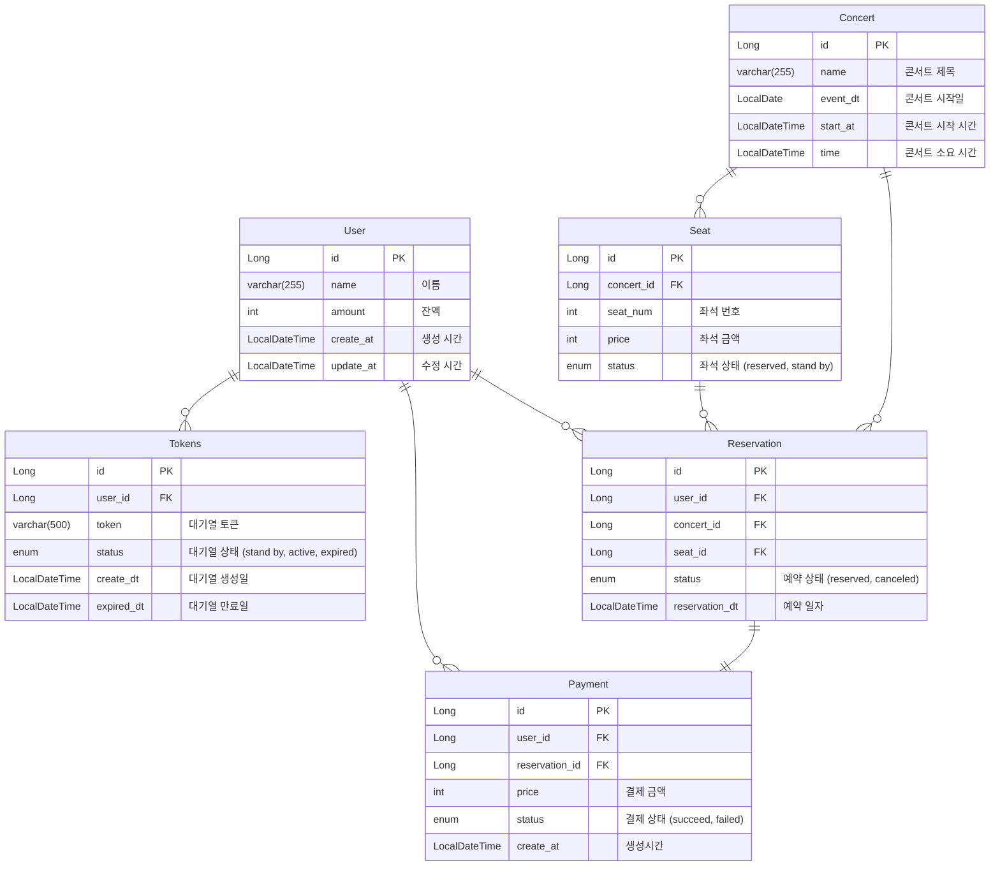

### ERD

```mermaid
erDiagram
    User{
        Long id PK
        varchar(255) name "이름"
        int amount "잔액"
        LocalDateTime create_at "생성 시간"
        LocalDateTime update_at "수정 시간"
    }
    
    Tokens {
        Long id PK
        Long user_id FK
        varchar(500) token "대기열 토큰"
        enum status "대기열 상태 (stand by, active, expired)"
        LocalDateTime create_dt "대기열 생성일"
        LocalDateTime expired_dt "대기열 만료일"
    }
    
    Concert {
        Long id PK
        varchar(255) name "콘서트 제목"
        LocalDate event_dt "콘서트 시작일"
        LocalDateTime start_at "콘서트 시작 시간"
        LocalDateTime time "콘서트 소요 시간"
    }
    
    Seat {
        Long id PK
        Long concert_id FK
        int seat_num "좌석 번호"
        int price "좌석 금액"
        enum status "좌석 상태 (reserved, stand by)"
    }
    
    Reservation {
        Long id PK
        Long user_id FK
        Long concert_id FK
        Long seat_id FK
        enum status "예약 상태 (reserved, canceled)"
        LocalDateTime reservation_dt "예약 일자"
    }
    
    Payment {
        Long id PK
        Long user_id FK
        Long reservation_id FK
        int price "결제 금액"
        enum status "결제 상태 (succeed, failed)"
        LocalDateTime create_at "생성시간"
    }


    User ||--o{ Tokens: ""
    User ||--o{ Payment: ""
    Reservation ||--|| Payment: ""
    User ||--o{ Reservation: ""
    Seat ||--o{ Reservation: ""
    Concert ||--o{ Seat: ""
    Concert ||--o{ Reservation: ""
```
