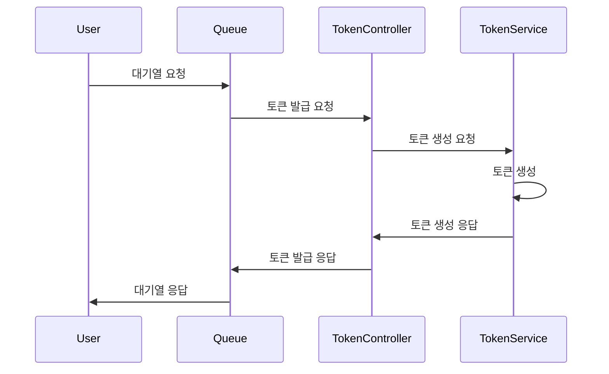
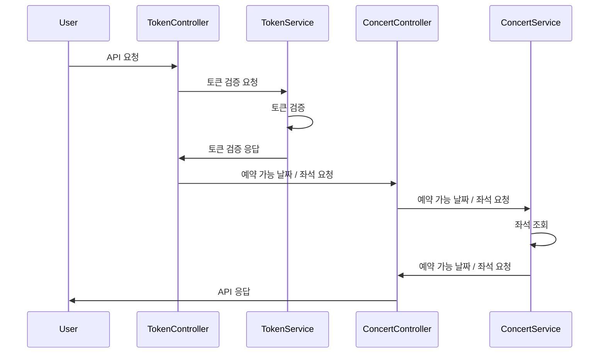
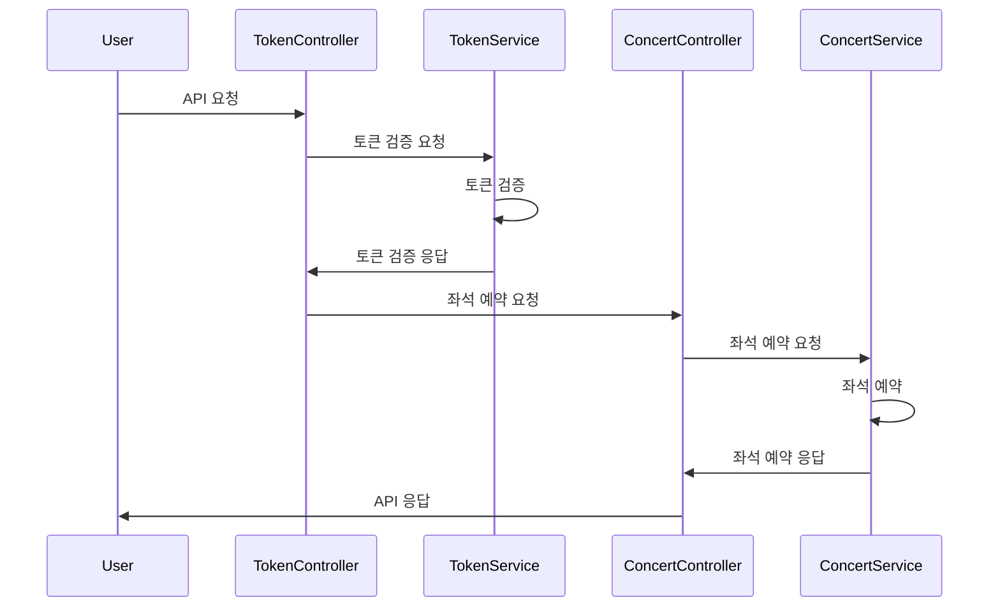
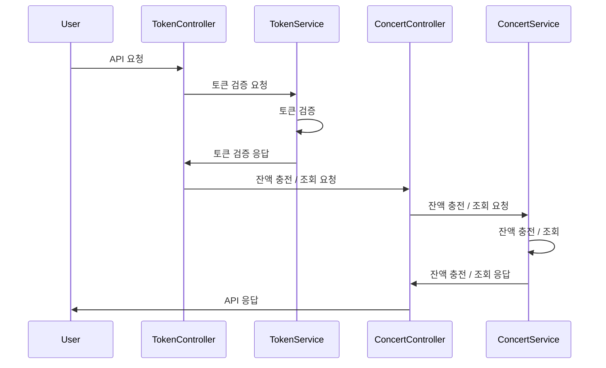
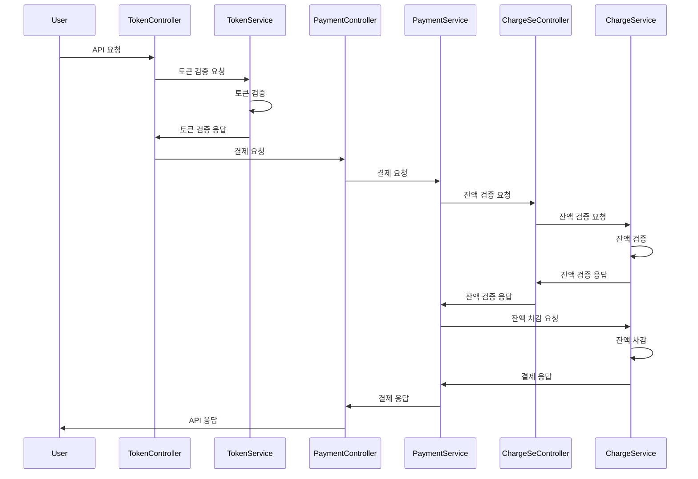

### 유저 대기열 토큰 기능

```mermaid
sequenceDiagram
    User ->> Queue : 대기열 요청
    Queue ->> TokenController : 토큰 발급 요청
    TokenController ->> TokenService : 토큰 생성 요청
    TokenService ->> TokenService : 토큰 생성
    TokenService ->> TokenController : 토큰 생성 응답
    TokenController ->> Queue : 토큰 발급 응답
    Queue ->> User : 대기열 응답
```

### 예약 가능 날짜 / 좌석 API

```mermaid
sequenceDiagram
    User ->> TokenController : API 요청
    TokenController ->> TokenService : 토큰 검증 요청
    TokenService ->> TokenService : 토큰 검증
    TokenService ->> TokenController : 토큰 검증 응답
    TokenController ->> ConcertController : 예약 가능 날짜 / 좌석 요청
    ConcertController ->> ConcertService : 예약 가능 날짜 / 좌석 요청
    ConcertService ->> ConcertService : 좌석 조회
    ConcertService ->> ConcertController : 예약 가능 날짜 / 좌석 요청
    ConcertController ->> User : API 응답
```

### 좌석 예약 요청 API

```mermaid
sequenceDiagram
    User ->> TokenController : API 요청
    TokenController ->> TokenService : 토큰 검증 요청
    TokenService ->> TokenService : 토큰 검증
    TokenService ->> TokenController : 토큰 검증 응답
    TokenController ->> ConcertController : 좌석 예약 요청
    ConcertController ->> ConcertService : 좌석 예약 요청
    ConcertService ->> ConcertService : 좌석 예약
    ConcertService ->> ConcertController : 좌석 예약 응답
    ConcertController ->> User : API 응답
```

### 잔액 충전 / 조회 API

```mermaid
sequenceDiagram
    User ->> TokenController : API 요청
    TokenController ->> TokenService : 토큰 검증 요청
    TokenService ->> TokenService : 토큰 검증
    TokenService ->> TokenController : 토큰 검증 응답
    TokenController ->> ConcertController : 잔액 충전 / 조회 요청
    ConcertController ->> ConcertService : 잔액 충전 / 조회 요청
    ConcertService ->> ConcertService : 잔액 충전 / 조회
    ConcertService ->> ConcertController : 잔액 충전 / 조회 응답
    ConcertController ->> User : API 응답
```

### 결제 API

```mermaid
sequenceDiagram
    User ->> TokenController : API 요청
    TokenController ->> TokenService : 토큰 검증 요청
    TokenService ->> TokenService : 토큰 검증
    TokenService ->> TokenController : 토큰 검증 응답
    TokenController ->> PaymentController : 결제 요청
    PaymentController ->> PaymentService : 결제 요청
    PaymentService ->> ChargeSeController : 잔액 검증 요청
    ChargeSeController ->> ChargeService : 잔액 검증 요청
    ChargeService ->> ChargeService : 잔액 검증
    ChargeService ->> ChargeSeController : 잔액 검증 응답
    ChargeSeController ->> PaymentService : 잔액 검증 응답
    PaymentService ->> ChargeService : 잔액 차감 요청
    ChargeService ->> ChargeService : 잔액 차감
    ChargeService ->> PaymentService : 결제 응답
    PaymentService ->> PaymentController : 결제 응답
    PaymentController ->> User : API 응답
```
